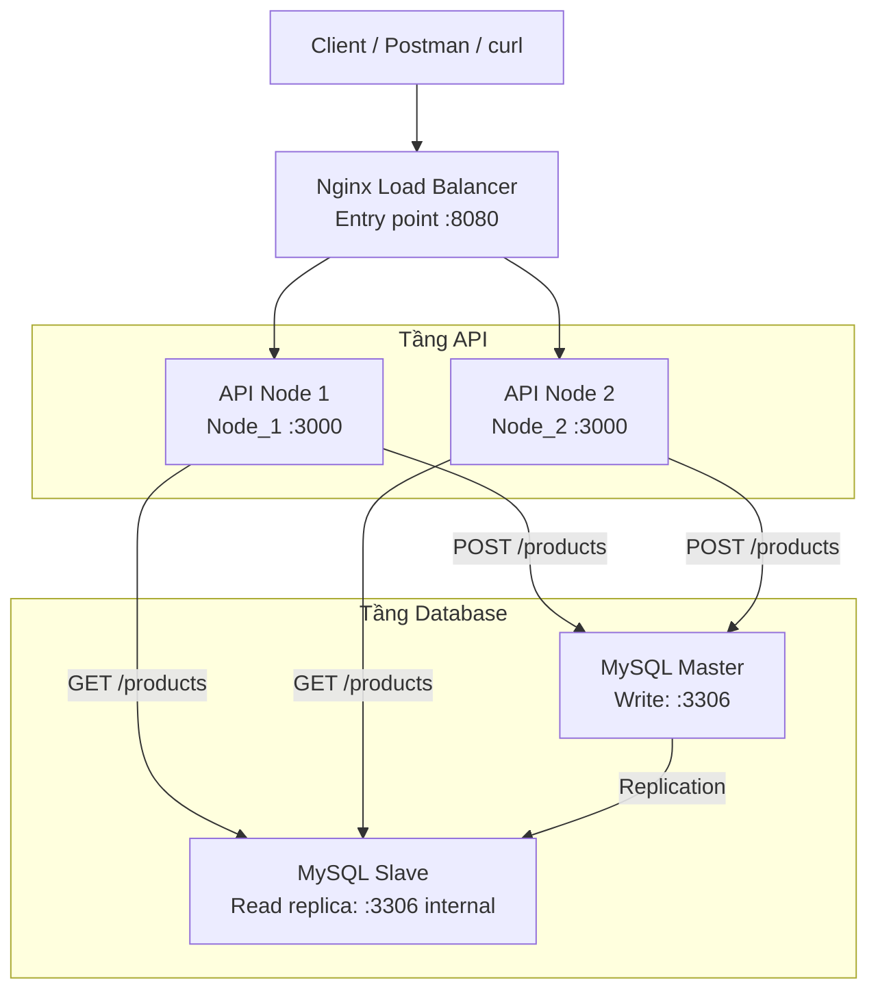

# Tài Liệu Kỹ Thuật - Hệ Thống Mở Rộng

Tài liệu này mô tả kiến trúc, cấu hình cốt lõi và quy trình cài đặt lại môi trường đồ án theo đúng mục tiêu: kiểm thử replication MySQL, sau đó mở rộng sang 2 API node và Nginx load balancing.

## 1. Mục Tiêu Thiết Kế

Hệ thống được xây dựng theo hướng đơn giản nhưng đủ rõ để demo:

- Client chỉ làm việc với Nginx.
- Nginx phân phối request sang 2 API node.
- API ghi dữ liệu vào MySQL Master.
- API đọc dữ liệu từ MySQL Slave.
- Slave nhận replication từ Master để chứng minh dữ liệu ghi vào Master có thể quan sát ở Slave.

## 2. Kiến Trúc Hệ Thống

Hệ thống dùng Docker Compose với 5 thành phần chính:

- 1 Nginx làm entry point duy nhất.
- 2 API node chạy cùng một mã nguồn Node.js.
- 1 MySQL Master để ghi dữ liệu.
- 1 MySQL Slave để nhận replication và phục vụ truy vấn đọc.

Sơ đồ minh họa kiến trúc tổng thể:



### Luồng xử lý chính

- `POST /products` ghi vào Master.
- `GET /products` đọc từ Slave.
- Nginx điều phối request đến 2 API node theo upstream round robin.
- Mỗi API node trả về `processed_by` để chứng minh request đã đi qua node nào.

Sơ đồ này có thể dùng trực tiếp trong báo cáo hoặc khi bạn trình bày ngắn trong video vì nó thể hiện rõ 3 tầng: client, API và database.

## 3. Các Cấu Hình Chính

### 3.1. Docker Compose

File: [docker-compose.yml](docker-compose.yml)

```yaml
services:
  mysql_master:
    image: mysql:8.0
    environment:
      MYSQL_ROOT_PASSWORD: root123
      MYSQL_DATABASE: products_db
      MYSQL_USER: app_user
      MYSQL_PASSWORD: app_password
    ports:
      - "3306:3306"
    volumes:
      - ./db/master-init.sql:/docker-entrypoint-initdb.d/init.sql
      - mysql_master_data:/var/lib/mysql
      - ./db/master.conf:/etc/mysql/conf.d/master.conf
    command: >
      --server-id=1
      --log-bin=mysql-bin
      --binlog-format=ROW

  api_node_1:
    build:
      context: ./app
    environment:
      PORT: 3000
      SERVER_ID: Node_1
      MASTER_HOST: mysql_master
      MASTER_PORT: 3306
      SLAVE_HOST: mysql_slave
      SLAVE_PORT: 3306
      DB_USER: app_user
      DB_PASSWORD: app_password
      DB_NAME: products_db
    ports:
      - "3001:3000"

  api_node_2:
    build:
      context: ./app
    environment:
      PORT: 3000
      SERVER_ID: Node_2
      MASTER_HOST: mysql_master
      MASTER_PORT: 3306
      SLAVE_HOST: mysql_slave
      SLAVE_PORT: 3306
      DB_USER: app_user
      DB_PASSWORD: app_password
      DB_NAME: products_db
    ports:
      - "3002:3000"

  nginx:
    image: nginx:1.27-alpine
    ports:
      - "8080:80"
    volumes:
      - ./nginx/nginx.conf:/etc/nginx/nginx.conf:ro

  mysql_slave:
    image: mysql:8.0
    environment:
      MYSQL_ROOT_PASSWORD: root123
      MYSQL_DATABASE: products_db
      MYSQL_USER: app_user
      MYSQL_PASSWORD: app_password
    ports:
      - "3307:3306"
    volumes:
      - ./db/slave-init.sql:/docker-entrypoint-initdb.d/init.sql
      - mysql_slave_data:/var/lib/mysql
      - ./db/slave.conf:/etc/mysql/conf.d/slave.conf
    command: >
      --server-id=2
      --relay-log=mysql-relay-bin
      --relay-log-index=mysql-relay-bin.index
      --read-only=ON
```

### 3.2. Nginx Load Balancer

File: [nginx/nginx.conf](nginx/nginx.conf)

```nginx
events {
  worker_connections 1024;
}

http {
  upstream api_backend {
    server api_node_1:3000 max_fails=2 fail_timeout=5s;
    server api_node_2:3000 max_fails=2 fail_timeout=5s;
  }

  server {
    listen 80;

    location / {
      proxy_pass http://api_backend;
      proxy_http_version 1.1;
      proxy_set_header Host $host;
      proxy_set_header X-Real-IP $remote_addr;
      proxy_set_header X-Forwarded-For $proxy_add_x_forwarded_for;
      proxy_set_header X-Forwarded-Proto $scheme;
      proxy_connect_timeout 2s;
      proxy_read_timeout 30s;
      proxy_send_timeout 30s;
      proxy_next_upstream error timeout http_502 http_503 http_504;
    }
  }
}
```

### 3.3. MySQL Master

File: [db/master.conf](db/master.conf)

```ini
[mysqld]
server-id=1
log-bin=mysql-bin
binlog-format=ROW
log-slave-updates=ON
```

File: [db/master-init.sql](db/master-init.sql)

```sql
CREATE USER IF NOT EXISTS 'repl'@'%' IDENTIFIED WITH mysql_native_password BY 'repl_password';
GRANT REPLICATION SLAVE ON *.* TO 'repl'@'%';
FLUSH PRIVILEGES;

CREATE TABLE IF NOT EXISTS products (
    id INT PRIMARY KEY AUTO_INCREMENT,
    name VARCHAR(255) NOT NULL,
    price DECIMAL(10, 2) NOT NULL,
    created_at TIMESTAMP DEFAULT CURRENT_TIMESTAMP,
    updated_at TIMESTAMP DEFAULT CURRENT_TIMESTAMP ON UPDATE CURRENT_TIMESTAMP
);
```

### 3.4. MySQL Slave

File: [db/slave.conf](db/slave.conf)

```ini
[mysqld]
server-id=2
relay-log=mysql-relay-bin
relay-log-index=mysql-relay-bin.index
read-only=ON
```

File: [db/slave-init.sql](db/slave-init.sql)

```sql
CREATE TABLE IF NOT EXISTS products (
    id INT PRIMARY KEY AUTO_INCREMENT,
    name VARCHAR(255) NOT NULL,
    price DECIMAL(10, 2) NOT NULL,
    created_at TIMESTAMP DEFAULT CURRENT_TIMESTAMP,
    updated_at TIMESTAMP DEFAULT CURRENT_TIMESTAMP ON UPDATE CURRENT_TIMESTAMP
);
```

### 3.5. API Read/Write Splitting

File: [app/src/server.js](app/src/server.js)

```javascript
const masterPool = mysql.createPool({
  ...commonPoolOptions,
  host: process.env.MASTER_HOST || '127.0.0.1',
  port: Number(process.env.MASTER_PORT || 3306)
});

const slavePool = mysql.createPool({
  ...commonPoolOptions,
  host: process.env.SLAVE_HOST || '127.0.0.1',
  port: Number(process.env.SLAVE_PORT || 3307)
});

app.post('/products', async (req, res) => {
  const [result] = await masterPool.execute(
    'INSERT INTO products (name, price) VALUES (?, ?)',
    [name.trim(), numericPrice]
  );

  const [rows] = await masterPool.execute('SELECT * FROM products WHERE id = ?', [result.insertId]);

  res.status(201).json({
    message: 'Product created successfully',
    processed_by: serverId,
    data: rows[0]
  });
});

app.get('/products', async (_req, res) => {
  const [rows] = await slavePool.query(
    'SELECT id, name, price, created_at, updated_at FROM products ORDER BY id ASC'
  );

  res.json({
    processed_by: serverId,
    source: 'slave',
    data: rows
  });
});
```

### 3.6. API Dependencies

File: [app/package.json](app/package.json)

```json
{
  "dependencies": {
    "dotenv": "^16.6.1",
    "express": "^4.21.2",
    "mysql2": "^3.14.3"
  }
}
```

## 4. Hướng Dẫn Cài Đặt Và Kiểm Thử

Phần này được viết theo đúng trình tự demo để bạn có thể vừa chạy lại hệ thống vừa quay video hoặc chụp minh chứng.

### Bước 1: Chuẩn bị môi trường

Bạn cần:

- Docker Desktop
- Docker Compose
- PowerShell hoặc terminal tương đương

Lưu ý quan trọng:

- Docker Desktop phải đang chạy trước khi dùng `docker-compose up -d --build`.
- Nếu gặp lỗi không kết nối được tới `npipe:////./pipe/dockerDesktopLinuxEngine`, hãy mở Docker Desktop và chờ trạng thái engine chuyển sang running.
- Nếu Docker đang ở chế độ Windows containers, hãy chuyển sang Linux containers vì toàn bộ cấu hình ở đây dùng image Linux như `mysql:8.0` và `nginx:1.27-alpine`.

### Bước 2: Khởi động toàn bộ hệ thống

Chạy tại thư mục gốc của dự án:

```powershell
docker-compose up -d --build
```

Ý nghĩa của bước này:

- Tạo 1 MySQL Master.
- Tạo 1 MySQL Slave.
- Tạo 2 API node.
- Tạo Nginx làm cổng vào duy nhất.

### Bước 3: Kiểm tra các service đã lên chưa

```powershell
docker-compose ps
```

Kỳ vọng thấy các service:

- mysql_master
- mysql_slave
- api_node_1
- api_node_2
- nginx

Nếu một service chưa chạy, kiểm tra log bằng:

```powershell
docker-compose logs mysql_master
docker-compose logs mysql_slave
docker-compose logs api_node_1
docker-compose logs api_node_2
docker-compose logs nginx
```

### Bước 4: Kiểm tra nhanh gateway qua Nginx

Gọi health endpoint nhiều lần để xác nhận request đi qua gateway:

```powershell
Invoke-RestMethod http://localhost:8080/health | ConvertTo-Json -Depth 5
Invoke-RestMethod http://localhost:8080/health | ConvertTo-Json -Depth 5
Invoke-RestMethod http://localhost:8080/health | ConvertTo-Json -Depth 5
```

Kết quả mong đợi:

```json
{
  "status": "ok",
  "processed_by": "Node_1"
}
```

Lưu ý: `processed_by` có thể là `Node_1` hoặc `Node_2` tùy request Nginx chuyển tới node nào.

### Bước 5: Cấu hình replication cho MySQL Slave

Lấy trạng thái Master:

```powershell
docker-compose exec mysql_master mysql -uroot -proot123 -e "SHOW MASTER STATUS;"
```

Từ kết quả, lấy hai giá trị chính:

- File
- Position

Ví dụ: `mysql-bin.000005` và `157`

Dừng replica IO thread trước khi đổi cấu hình:

```powershell
docker-compose exec mysql_slave mysql -uroot -proot123 -e "STOP REPLICA IO_THREAD FOR CHANNEL '';"
```

Thiết lập lại nguồn đồng bộ:

```powershell
docker-compose exec mysql_slave mysql -uroot -proot123 -e "CHANGE MASTER TO MASTER_HOST='mysql_master', MASTER_USER='repl', MASTER_PASSWORD='repl_password', MASTER_LOG_FILE='mysql-bin.000005', MASTER_LOG_POS=157;"
```

Khởi động replica:

```powershell
docker-compose exec mysql_slave mysql -uroot -proot123 -e "START REPLICA;"
```

Kiểm tra trạng thái replication:

```powershell
docker-compose exec mysql_slave mysql -uroot -proot123 -e "SHOW REPLICA STATUS\G"
```

Kỳ vọng thấy:

- Replica_IO_Running: Yes
- Replica_SQL_Running: Yes
- Seconds_Behind_Source: 0

### Bước 6: Demo ghi dữ liệu vào Master

Gửi request POST qua gateway:

```powershell
$body = @{ name = 'Video Demo Item'; price = 123.45 } | ConvertTo-Json
Invoke-RestMethod -Method Post -Uri http://localhost:8080/products -ContentType 'application/json' -Body $body | ConvertTo-Json -Depth 5
```

Kết quả mong đợi:

```json
{
  "message": "Product created successfully",
  "processed_by": "Node_2",
  "data": {
    "id": 6,
    "name": "Video Demo Item",
    "price": "123.45"
  }
}
```

`processed_by` có thể là `Node_1` hoặc `Node_2`, tùy node Nginx chọn ở request đó.

### Bước 7: Xác minh dữ liệu đã vào Master

Chạy truy vấn trực tiếp trên Master:

```powershell
docker-compose exec mysql_master mysql -uroot -proot123 products_db -e "SELECT * FROM products WHERE name='Video Demo Item';"
```

Kết quả mong đợi là có bản ghi vừa chèn.

Nếu muốn kiểm tra tổng thể dữ liệu trong bảng:

```powershell
docker-compose exec mysql_master mysql -uroot -proot123 products_db -e "SELECT id, name, price, created_at, updated_at FROM products ORDER BY id DESC LIMIT 5;"
```

### Bước 8: Gọi GET để đọc từ Slave

```powershell
Invoke-RestMethod http://localhost:8080/products | ConvertTo-Json -Depth 5
```

Khi quay video, cần nhấn mạnh 2 điểm:

- phản hồi có `source: slave`
- bản ghi vừa POST xuất hiện trong danh sách GET

### Bước 9: Kiểm tra hệ thống phân phối request giữa 2 API node

Gọi nhiều lần endpoint health:

```powershell
Invoke-RestMethod http://localhost:8080/health | ConvertTo-Json -Depth 5
Invoke-RestMethod http://localhost:8080/health | ConvertTo-Json -Depth 5
Invoke-RestMethod http://localhost:8080/health | ConvertTo-Json -Depth 5
Invoke-RestMethod http://localhost:8080/health | ConvertTo-Json -Depth 5
```

Khi quay video, giữ màn hình terminal để thấy `processed_by` đổi qua lại giữa `Node_1` và `Node_2`.

### Bước 10: Chaos test - dừng một node API

Dừng thủ công một node:

```powershell
docker-compose stop api_node_1
```

Gọi lại request qua Nginx:

```powershell
Invoke-RestMethod http://localhost:8080/health | ConvertTo-Json -Depth 5
Invoke-RestMethod http://localhost:8080/products | ConvertTo-Json -Depth 5
```

Kết quả mong đợi:

- request vẫn trả về bình thường
- `processed_by` sẽ là `Node_2`
- hệ thống không bị dừng dù một node API đã tắt

Khởi động lại node sau khi test xong:

```powershell
docker-compose start api_node_1
```

### Bước 11: Dọn dẹp khi cần

Nếu muốn dừng toàn bộ hệ thống:

```powershell
docker-compose down
```

Nếu muốn xóa luôn dữ liệu volume để chạy lại từ đầu:

```powershell
docker-compose down -v
```

## 5. Ghi Chú Kỹ Thuật

- Nginx là entry point duy nhất cho client.
- API sử dụng hai connection pool riêng cho Master và Slave.
- Master xử lý ghi, Slave xử lý đọc.
- Slave được đặt read-only để tránh ghi nhầm.
- processed_by trong response dùng để chứng minh request đã đi qua node nào.

## 6. Kết Luận

Thiết lập này phù hợp với mục tiêu đồ án vì:

- Load balancer hoạt động làm điểm vào duy nhất.
- 2 API node chạy song song trên cùng mã nguồn.
- MySQL Master-Slave replication được cấu hình rõ ràng.
- API đã tách luồng đọc và ghi để dễ demo.
- Hệ thống có thể kiểm thử lỗi bằng cách dừng một API node mà vẫn duy trì hoạt động.
